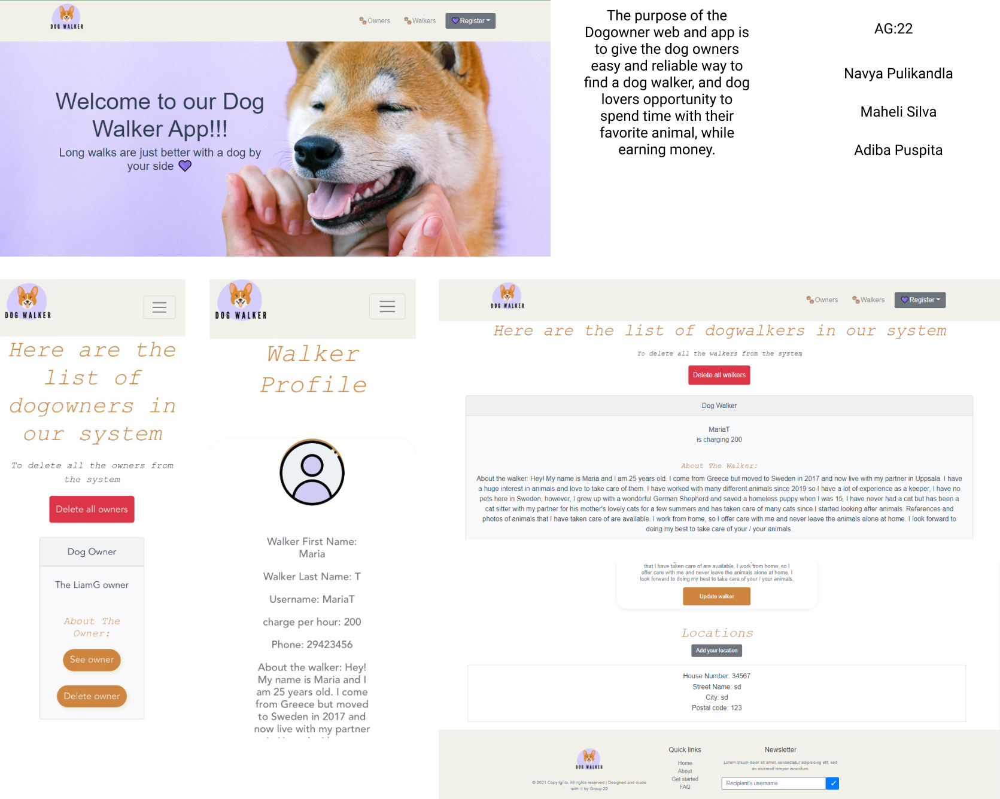

# Backend and Frontend Template

Latest version: https://git.ita.chalmers.se/courses/dit341/group-00-web (public Github [mirror](https://github.com/dit341/group-00-web))

## Project Structure

| File        | Purpose           | What you do?  |
| ------------- | ------------- | ----- |
| `server/` | Backend server code | All your server code |
| [server/README.md](server/README.md) | Everything about the server | **READ ME** carefully! |
| `client/` | Frontend client code | All your client code |
| [client/README.md](client/README.md) | Everything about the client | **READ ME** carefully! |
| [docs/DEPLOYMENT.md](docs/DEPLOYMENT.md) | Free online production deployment | Deploy your app online in production mode |
| [docs/LOCAL_DEPLOYMENT.md](docs/LOCAL_DEPLOYMENT.md) | Local production deployment | Deploy your app local in production mode |

## Requirements

The version numbers in brackets indicate the tested versions but feel free to use more recent versions.
You can also use alternative tools if you know how to configure them (e.g., Firefox instead of Chrome).

* [Git](https://git-scm.com/) (v2) => [installation instructions](https://www.atlassian.com/git/tutorials/install-git)
  * [Add your Git username and set your email](https://docs.gitlab.com/ce/gitlab-basics/start-using-git.html#add-your-git-username-and-set-your-email)
    * `git config --global user.name "YOUR_USERNAME"` => check `git config --global user.name`
    * `git config --global user.email "email@example.com"` => check `git config --global user.email`
  * > **Windows users**: We recommend to use the [Git Bash](https://www.atlassian.com/git/tutorials/git-bash) shell from your Git installation or the Bash shell from the [Windows Subsystem for Linux](https://docs.microsoft.com/en-us/windows/wsl/install-win10) to run all shell commands for this project.
* [Chalmers GitLab](https://git.ita.chalmers.se/) => Login with your **Chalmers CID** choosing "Sign in with" **Chalmers Login**. (contact [support@chalmers.se](mailto:support@chalmers.se) if you don't have one)
  * DIT341 course group: https://git.ita.chalmers.se/courses/dit341
  * [Setup SSH key with Gitlab](https://docs.gitlab.com/ee/ssh/)
    * Create an SSH key pair `ssh-keygen -t ed25519 -C "email@example.com"` (skip if you already have one)
    * Add your public SSH key to your Gitlab profile under https://git.ita.chalmers.se/profile/keys
    * Make sure the email you use to commit is registered under https://git.ita.chalmers.se/profile/emails
  * Checkout the [Backend-Frontend](https://git.ita.chalmers.se/courses/dit341/group-00-web) template `git clone git@git.ita.chalmers.se:courses/dit341/group-00-web.git`
* [Server Requirements](./server/README.md#Requirements)
* [Client Requirements](./client/README.md#Requirements)

## Getting started

```bash
# Clone repository
git clone git@git.ita.chalmers.se:courses/dit341/group-00-web.git

# Change into the directory
cd group-00-web

# Setup backend
cd server && npm install
npm run dev

# Setup frontend
cd client && npm install
npm run serve
```

> Check out the detailed instructions for [backend](./server/README.md) and [frontend](./client/README.md).

## Visual Studio Code (VSCode)

Open the `server` and `client` in separate VSCode workspaces or open the combined [backend-frontend.code-workspace](./backend-frontend.code-workspace). Otherwise, workspace-specific settings don't work properly.

## System Definition (MS0)

### Purpose

The purpose of this Dog Walker website/app is to assist dog owners in finding someone to walk their dogs. It also allows dog lovers to spend time with one’s dog while at the same time earning money.

### Pages

- **home** : Page has an overall view on what the system does with a header. Header will let the users to view dogowners and walkers along with that they will be able to register new walkers and new dogowners into the system.

- **walkers**: The walkers page displays a list of walkers registered in the system allowing the users to view single walkers profile to see their full profile. This page will have the access to delete all the walkers from the system.

- **dogowners**: The dogowners page displays a list of dogowners registered in the system allowing the users to view single dog owners profile to see their full profile. This page will have the access to delete all the dogowners from the system.

- **walkersprofile** : This page will have the full details of that particular walker. Here the user can add location for that particular walker and also update the walkers information if needed. All the locations of that walker will be displayed in their profile.

- **dogownersprofile** : This page will have the full details of that particular dogowner. Pets of the dogowners can be added the pets can one or more based on how many they have, location for that particular dogowner can also be added and also allowing users to update the dogowners information if needed. All the locations and pets of that dogowners will be displayed in their profile.


### Entity-Relationship (ER) Diagram


## Teaser (MS3)


